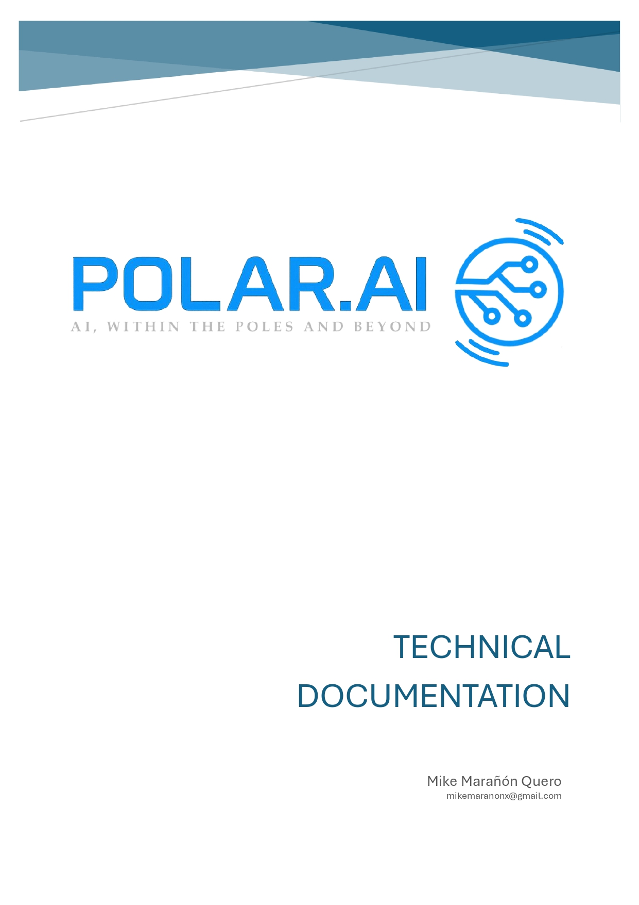

<p align="center">
    
</p>

<div class="page-break"></div>

# Table of Contents (Provisional)

- [Introduction](#introduction)
- [1. POLAR Node: Central Management Hub](#1-polar-node-central-management-hub)
    - [1.1 `main.py`](#11-mainpy)
    - [1.2 `flask_server.py`](#12-flask_serverpy)
        - [The `Server` class: Initialization](#the-server-class-initialization)
        - [The `Server` class: modules instances](#the-server-class-modules-instances)
    - [1.3 `app_routes.py`](#13-app_routespy)
    - [1.4 `data_m` module: the database of POLAR ecosystem](#14-data_m-module-the-database-of-polar-ecosystem)
        - [`database.py`: Central query system of POLAR node](#databasepy-central-query-system-of-polar-node)
        - [`db_methods/t_users.py`: table and query definitions for the users table](#db_methodst_userspy-table-and-query-deffinitions-for-the-users-table)
        - [`db_methods/t_sessions.py`: table and query definitions for the sessions table](#db_methodst_sessionspy-table-and-query-deffinitions-for-the-sessions-table)
        - [`db_methods/t_commands.py`: table and query definitions for the commands table](#db_methodst_commandspy-table-and-query-deffinitions-for-the-commands-table)       
    - [1.5 `user_m` module: management of POLAR users](#15-user_m-module-management-of-polar-users)
    - [1.6 `api_m` module: endpoints and use cases](#16-api_m-module-endpoints-and-use-cases)
    - [1.7 `cli_m` module: the POLAR node terminal](#17-cli_m-module-the-polar-node-terminal)
- [2. POLAR Core: Model Deployment & Management](#2-polar-core-model-deployment--management)
- [3. POLAR Forge: Model Creation and Training](#3-polar-forge-model-creation-and-training)
- [4. POLAR Studio: User Interaction Layer](#4-polar-studio-user-interaction-layer)
- [5. Common Utilities and Configurations](#5-common-utilities-and-configurations)

<div class="page-break"></div>

# Introduction

`POLAR.AI` is an open-source ecosystem designed to fully manage the lifecycle of artificial intelligence models in both **on-premise** and **cloud** environments. Its main goal is to provide a modular, scalable, and maintainable architecture that allows developers, data scientists, and organizations to create, deploy, and interact with AI models seamlessly.

The ecosystem is structured around four core components:

1. **POLAR Node**: The central hub responsible for coordinating communication between all environment components, handling **user authentication**, **role management**, and exposing APIs to orchestrate services across the ecosystem. Its interface is accessible via a web portal or local shell, simulating a terminal experience.

2. **POLAR Core**: The deployment engine that manages and stores models. It handles inference, connections to external services (such as Azure or OpenAI APIs), and provides a secure environment to execute AI workloads.

3. **POLAR Forge**: A module focused on model creation, training, and fine-tuning. It supports both **neural networks** and **foundational models**, providing developers with tools to build models from scratch or adapt pre-existing ones.

4. **POLAR Studio**: The main user-facing interface that allows interaction with models, both local (from Core) and external (via registered APIs). Studio ensures a seamless experience for end-users to query, visualize, and analyze AI outputs.

**Key design principles:**

- **Open-source and free**: POLAR.AI is intended to be fully accessible, with no commercial restrictions.
- **SOLID architecture**: Every module follows the single-responsibility principle and other SOLID guidelines to ensure maintainability and scalability.
- **Cloud & on-premise compatibility**: The ecosystem can be deployed via Docker or Kubernetes, supporting hybrid environments.
- **Modular and extensible**: Each component is independent yet interoperable, allowing future expansion (e.g., integrating new modules or APIs).

This documentation provides a detailed breakdown of each module, including its structure, entities, repositories, services, and configuration, following best practices for maintainable software and secure operations.

<div class="page-break"></div>

# 1. POLAR Node: Central Management Hub

POLAR node is the main component of this ecosystem. every other component must be connected to it in order to work. The fundamental logic followed for this decission is motivated by the centralisation of management, so that every sensitive and important data as well as the flow of information in the ecosystem **must** be processed in some point by this central node.

We have 3 main files that start the engine of this software:
- `main.py`: this file is the first entrance of the software, the running starts here
- `flask-server.py`: here we initiate the server in flask, for an easy web access
- `app_routes.py`: here we initiate the endpoints for the standart API calls of POLAR node.

digging deeper into those files is very important for a further understanding of the rest of this software.

## 1.1 `main.py`

As mentioned before, this file initiates the full engine of POLAR node, it has two main components:
- **flask server**: this creates the server to enable a web access, for an easier and friendly user interface.
    ```python
    def run_flask():
        print("||=================================||")
        print("||       Starting NODE server      ||")
        print("||=================================||")
        Server(app)
    ```
- **CLI server**: this creates the CLI server, a module that will be explained later on to which admins can connect to execute fast commands related to every functionality POLAR node has.
    ```python
    def run_cli():
        print("||=================================||")
        print("||       Starting CLI server       ||")
        print("||=================================||")
        cli = CliServer()
        cli.start()
    ```

As we can see, both methods call the starting processes of two objects: `Server` and `CliServer`. Those objects will be explained in [Flask Server](##1.2-flask_server.py) and [CLI Server](##1.7-cli_m-module-the-POLAR-node-terminal) points.
the general code of this file calls these two methods:
```python
if __name__ == "__main__":
    # Thread for Flask, daemon so it closes with the main process
    flask_thread = threading.Thread(target=run_flask, daemon=True)
    flask_thread.start()

    # Thread for CLI, also as daemon or not depending on whether you want it to close with the process
    cli_thread = threading.Thread(target=run_cli, daemon=True)
    cli_thread.start()

    # The main thread waits for both to finish
    flask_thread.join()
    cli_thread.join()
```
in the `main` method, we can see that each service is initiated in a thread, this ensures that `CLI Server` and `Flask Server` dont interrupt each others processes througout the running life of this software

## 1.2 `flask_server.py`

This file is responsible for creating and managing the **Flask server** that runs the POLAR node web application. Its main role is to initialize the HTTP server, load the necessary configurations, and ensure that the endpoints defined in `app_routes.py` are available.

The structure of this file focuses on creating an isolated `Server` class, following the **Single Responsibility Principle**:  
- The server’s only concern is to handle web requests. 
- Business logic is fully separated and only delegated through the API routes.

### The `Server` class: Initialization

The `Server` class is instantiated with the Flask `app` object. When executed, it starts the server with the configured host and port.

```python
def __init__(self, app: Flask):
    self.app = app
    self.app.secret_key = os.urandom(24)

    # MODULES INITIALIZACION
    # ...
    # CODE WRITEN AND EXPLAINED BELLOW

    # Port configuration
    port = int(os.environ.get('PORT', 5000))

    # Detect if running in main thread
    is_main_thread = threading.current_thread() is threading.main_thread()
    if not is_main_thread:
        print("⚠️ Flask running in a secondary thread: disabling debug and reloader.")

    self.app.run(
        debug=is_main_thread,           # Enable debug only in the main thread
        use_reloader=is_main_thread,    # Avoid reloader in secondary threads
        host='0.0.0.0',
        port=port
    )
  
  # Clear sessions on initialization
  self.database.t_sessions.clear_sessions()
```

### The `Server` class: modules instances

In this class we also have several modules that get instanced in the `__init__` method. this ensure that each module will be initiated in a specific order during the creation of the Flask Server:

```python
def ini_database(self):
    return Database()

def ini_cli_manager(self):
    return CliManager()

def ini_user_manager(self):
    return UserManager()

def ini_app_routes(self):
    return AppRoutes(self.app, self.user_manager, self.database)

def ini_api_manager(self):
    return ApiManager(self.app, self.user_manager, self.database, self.cli_manager)
```

as we can see in the `__init__` method, there are some modules that need access to other modules, such as `api_manager` that needs access to `user_manager`, `database` and `cli_manager`:

```python
def __init__(self, app: Flask):

    #...

    self.database = self.ini_database()
    self.cli_manager = self.ini_cli_manager()
    self.user_manager = self.ini_user_manager()
    self.app_routes = self.ini_app_routes()
    self.api_manager = self.ini_api_manager()

    #...
```

each module has some very specific roles in this server:
- `Database`: initializes the persistence layer and ensures that all tables and session logic are ready. Sessions are cleared at startup to guarantee a clean environment.
- `CliManager`: prepares the logic for the POLAR node terminal. It enables administrative commands to be executed via CLI.
- `UserManager`: responsible for managing user authentication, sessions, and role assignments.
- `AppRoutes`: injects the application routes into Flask, exposing the REST API endpoints for basic operations.
- `ApiManager`: manages the modular APIs that connect POLAR node to other components in the ecosystem, delegating advanced logic to specific managers.

<div class="page-break"></div>

## 1.3 `app_routes.py`

This file is composed of a main class named `AppRoutes` which defines every endpoint in the web interface. There is a main process between every endpoint: it checks the autentication of the user for every request, returning the defined page if the auth is accepted or returning the `login.html` page instead.

The `__init__` method of this class registers the `UserManager` and `Database` in local variables for better access, it also calls the endpoint registering method:
```python
def __init__(self, app, user_manager: UserManager, database: Database):
    self.app = app
    self.user_manager = user_manager
    self.database = database
    self._register_routes()
```
The next method is as important as the `__init__` one. `_register_routes()` calls every defined method in this class to take the flask `add_url_rule()` method and register them as endpoints:

```python
def _register_routes(self):
    self.app.add_url_rule("/", "home", self.get_home, methods=["GET"])
    self.app.add_url_rule("/login", "login", self.get_login, methods=["GET", "POST"])
    self.app.add_url_rule("/logout", "logout", self.get_logout, methods=["POST"])

def get_home(self):
    user = self.user_manager.check_user(request)
    if user:            
        return render_template("index.html", user=user)  # Redirect to index.html
    return render_template("login.html")
```
here we have a list of the current methods and theis respective endpoints:

| Endpoint             | Method                 | Description                                                                                       |
|----------------------|------------------------|---------------------------------------------------------------------------------------------------|
| /                    | `get_home()`           | Home page endpoint. Returns index.html if authenticated, login.html otherwise                     |
| /login               | `get_login()`          | Authentication endpoint. GET returns the login form, POST processes login credentials             |
| /logout              | `get_logout()`         | Ends the current user session and redirects to login page                                         |
| /sites/shell         | `get_cli()`            | Opens the POLAR node terminal interface for command-line interactions via the web                 |
| /sites/database      | `get_database()`       | Provides access to the database management dashboard, allowing inspection and basic operations    |
| /sites/command-forge | `get_command_forge()`  | Launches the Command Forge interface for creating and managing custom commands in the ecosystem   |

<div class="page-break"></div>

## 1.4 `data_m` module: the database of POLAR ecosystem

The `data_m` module serves as the core data management layer for the POLAR ecosystem. It is responsible for all database operations, including the creation, retrieval, updating, and deletion of records related to users, sessions, roles, and other entities essential to the functioning of the POLAR node.

The design of the database implementation through the server gives it several responsibilities:
- **Database Initialization:** Sets up the required tables and ensures the schema is up-to-date on startup.
- **Session Management:** Handles user sessions, including creation, validation, and cleanup, to maintain secure and consistent authentication flows.
- **User and Role Storage:** Stores user credentials, roles, and permissions, supporting robust access control mechanisms.
- **Data Abstraction:** Provides a clean API for other modules (such as `user_m` and `api_m`) to interact with persistent data without exposing low-level database logic.
- **Extensibility:** Designed to allow easy addition of new tables or data entities as the ecosystem grows.

The module includes in geenral aspects:

- **`database.py`**: Central entry point for all database operations.
- **`db_connector.py`**: Class that connects the server to the database.
- **Table abstractions**: Classes or methods for managing specific tables (e.g., `t_users`, `t_sessions`, `t_commands`).
- **Utility functions**: Helpers for migrations, data validation, and connection management.

By centralizing all data-related logic, the `data_m` module ensures that the POLAR node remains maintainable, secure, and scalable as new features and modules are integrated.

### `database.py`: Central query system of POLAR node

### `db_methods/t_users.py`: table and query deffinitions for the users table

### `db_methods/t_sessions.py`: table and query deffinitions for the sessions table

### `db_methods/t_commands.py`: table and query deffinitions for the commands table

<div class="page-break"></div>

## 1.5 `user_m` module: management of POLAR users


<div class="page-break"></div>

## 1.6 `api_m` module: endpoints and use cases


<div class="page-break"></div>

## 1.7 `cli_m` module: the POLAR node terminal


<div class="page-break"></div>

# 2. POLAR Core: Model Deployment & Management


<div class="page-break"></div>

# 3. POLAR Forge: Model Creation and Training


<div class="page-break"></div>

# 4. POLAR Studio: User Interaction Layer